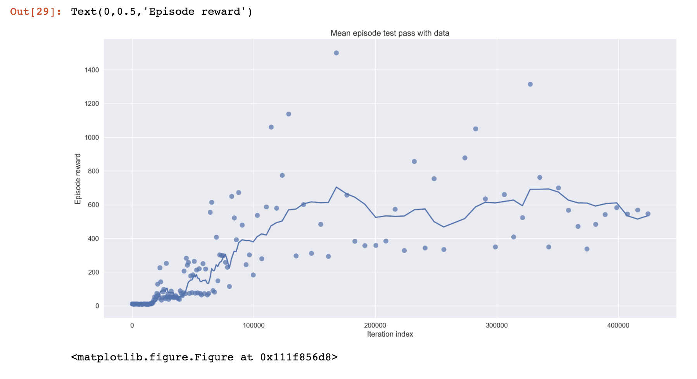
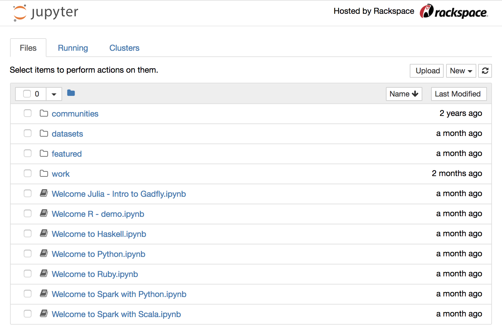

# Notebook Overview

> Jupyter Notebook Graphing
> 

This guide contains basic instructions for how to setup the [Jupyter Notebook App][1] and contains an example notebook for how to access Bonsai's API through the notebook environment. Instructions for how to setup and use the APIs are contained within the notebook itself.

**Before you read this guide** you will need to have successfully trained a BRAIN using either the [Quick Start][2] web guide or have [Run the Platform Locally][3]. This Jupyter Notebook will access information about the BRAINs you have trained and their training data.

Jupyter Notebooks are often used in the data science community to access, analyze, and visualize data. This notebook will guide you through how to access Bonsai's API so that you have access to your Bonsai BRAIN's raw data for plotting and analysis. After following this guide you should be able to:

* empower your training with notebooks
* get raw data from the Bonsai API
* do advanced analysis of training data
* visualize results with feature rich graphs

## What Are Jupyter Notebooks?

> Example Jupyter Notebook Dashboard
> 

Notebook documents (or “notebooks”) are documents produced by the [Jupyter Notebook App][1], which contain both computer code (e.g. python) and rich text elements (paragraph, equations, figures, links, etc...). Notebook documents are both human-readable documents containing the analysis description and the results (figures, tables, etc..) as well as executable documents which can be run to perform data analysis.

The Jupyter Notebook App is a server-client application that allows editing and running notebook documents via a web browser. The Jupyter Notebook App can be executed on a local desktop requiring no internet access.

In addition to displaying/editing/running notebook documents, the Jupyter Notebook App has a “Dashboard” (Notebook Dashboard), a “control panel” showing local files and allowing to open notebook documents or shutting down their kernels.

If you're new to Jupyter notebook try their quick demo online at <https://try.jupyter.org/>.

### Installing Jupyter Notebook

If you already have Anaconda installed, then you will already have the necessary package installed and can simply run in a terminal `jupyter notebook` to access the Dashboard for the folder it's run in.

If you want to use `pip` to install Jupyter you can follow the installation and run instructions on the [Install][4] or [Running the Notebook][5] official Jupyter documentation.

<aside class="notice">
Visualization rich tools like plotly may hit the default data rate limit of Jupyter Notebook.
</aside> 

This can be solved by launching the Jupyter Notebook App by setting a higher data rate limit by starting it with `jupyter notebook --NotebookApp.iopub_data_rate_limit=1000000`.

# Download Bonsai's API Notebook

Download the `.ipynb` notebook file on Bonsai's GitHub or clone the repo here: <https://github.com/BonsaiAI/bonsai-jupyter-notebook>

# More Resources

The [API Reference][6] contains detailed information on the API calls used in this notebook as well as others you might want to use after understanding this notebook.

The comments and instructions inside of the Jupyter Notebook should sufficiently explain the API calls and what to expect from the outputs but if you have any issues with this notebook please [contact support][7].

[1]: http://jupyter.org/
[2]: http://docs.bons.ai/guides/getting-started.html
[3]: http://docs.bons.ai/guides/local-dev-guide.html
[4]: https://jupyter.readthedocs.io/en/latest/install.html
[5]: https://jupyter.readthedocs.io/en/latest/running.html
[6]: ../references/api-reference.html
[7]: https://bons.ai/contact-us#contact-page-form